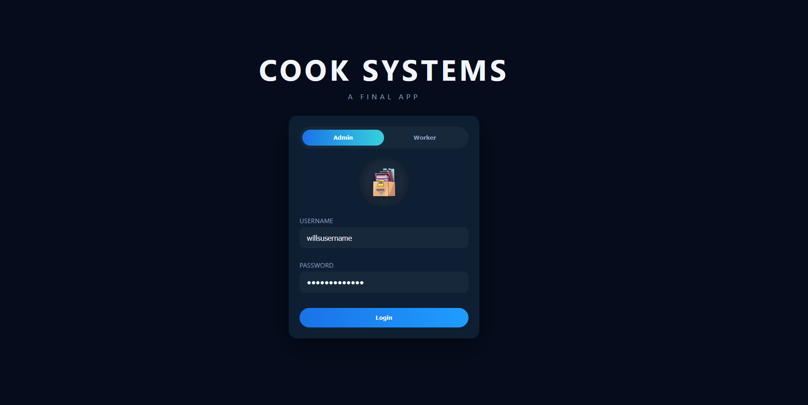
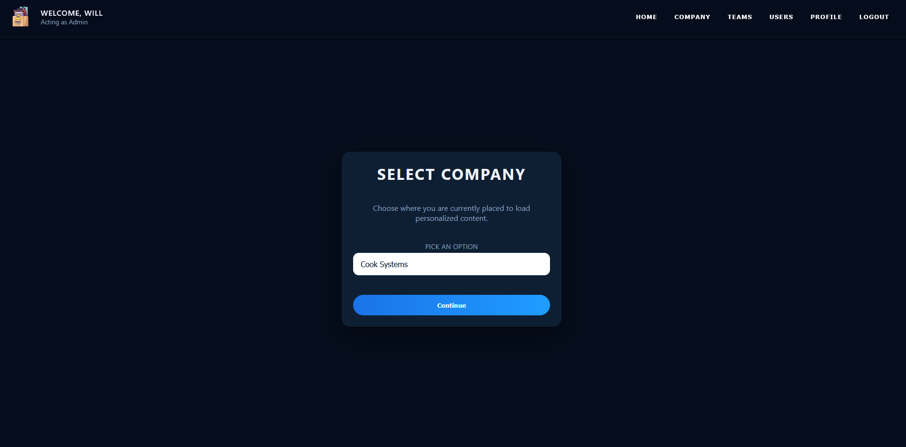
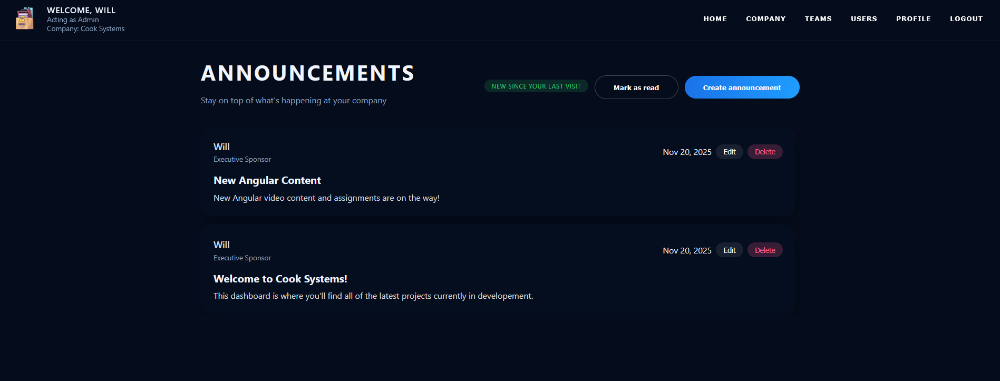
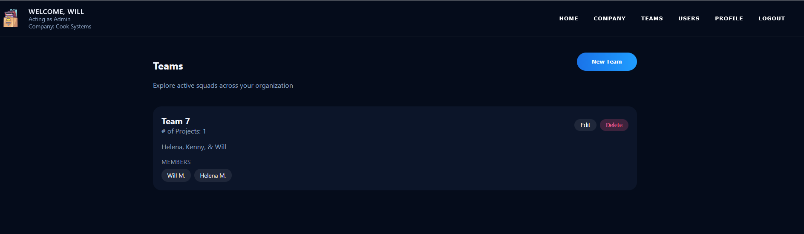
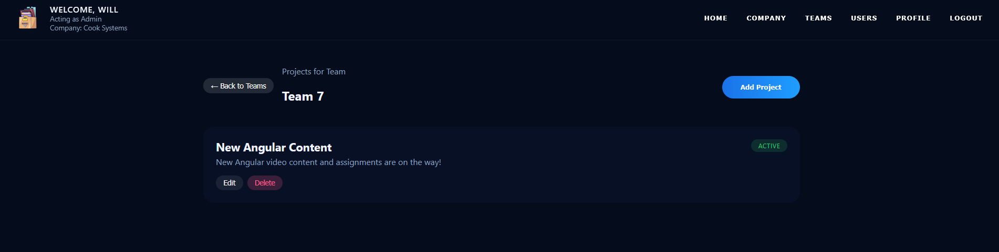
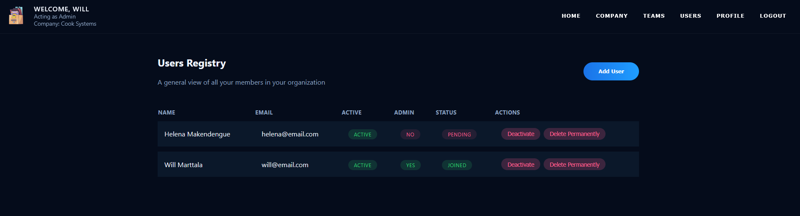

# Project Management Dashboard

## Overview
This project consists of a Spring Boot backend API and an Angular frontend that work together to provide a comprehensive company project management system. The application supports two user roles (Admin and Worker) and includes features for managing announcements, teams, projects, and users across multiple companies.

Check GitHub Wiki tab for API documentation.

### ERD


### Wireframe
[Figma Wireframe Link](https://www.figma.com/file/huwXGJxW6BCIbk4p2QcZG2/Final-Prototype?type=design&node-id=0-1&mode=design&t=1Ef7iFB5zY6Kjdyb-0)

## Screenshots

### Login Page

*Authentication interface with role selection (Admin/Worker)*

### Company Selection

*Select company for compancy specific information*

### Announcements Dashboard

*View company-wide announcements with new content indicators and admin controls*

### Teams Management

*Manage teams across company with team names, description, and members*

### Projects View

*Track team projects with status indicators*

### Users Registry

*Admin interface for managing all company users with role and status tracking*

### Profile Management

*Update personal information, credentials, and contact details*

---

## Getting Started

### Prerequisites
- **Java 11 MIN, Java 17 MAX** 
- **Node.js (14+)**
- **PostgreSQL (12+)** 
- **Maven (3.6+)** 
- **Angular CLI 15+**

### Local Setup

1. **Clone the repository:**
```bash
git clone https://github.com/minh-t-coding/project-management-dashboard.git
cd project-management-dashboard
```

2. **Update Database Credentials**

In `backend/src/main/resources/application.properties`:
```properties
spring.datasource.url=jdbc:postgresql://localhost:5432/postgres
spring.datasource.username=postgres
spring.datasource.password=your_password_here
```

3. **Backend Setup**

Navigate to the backend directory and run:
```bash
cd backend

mvn clean install
mvn spring-boot:run
```

The backend will start on `http://localhost:8080`

4. **Frontend Setup**

In a new terminal, navigate to the frontend directory:
```bash
cd frontend

npm install
ng serve
```

The frontend will start on `http://localhost:4200`

### Pre-Seeded Users
The back end should pre-seed the database with some users if you want to just check out the application flow.

You can get started by navicating to `http://localhost:4200` and logging in with:
```properties
username: willsusername
password: willspassword
```

## Features
### Admin Features
- **User Management**: Add, edit, and deactivate users
- **Company Selection**: Switch between multiple companies
- **Team Management**: Create, edit, and delete teams with member assignments
- **Project Management**: Create, edit, and deactivate projects for teams
- **Announcements**: Post and edit company-wide announcements
- **Full CRUD Operations**: Complete control over all resources for company

### Worker Features
- **View Announcements**: See company announcements with new content indicators
- **Team Access**: View teams they're assigned to
- **Project Collaboration**: View and edit projects for their teams
- **Profile Management**: Update personal profile and credentials

## Contributors
- **Minh Nguyen**
- **Efrain Medina**
- **Matthew Robinson**